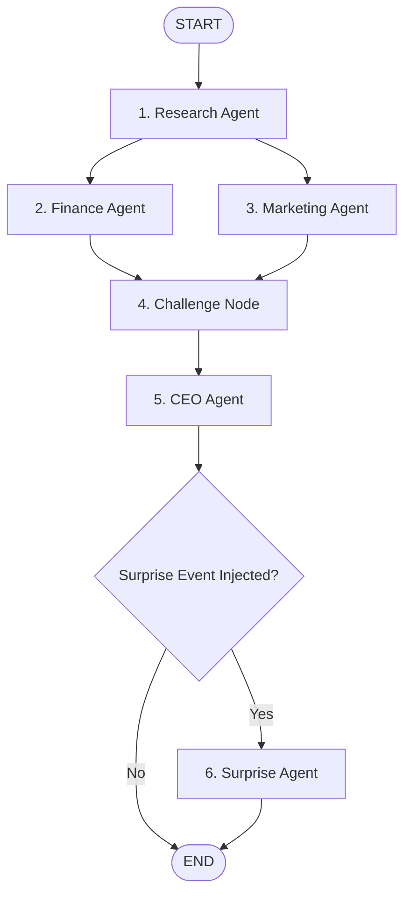

# AgentZero // Multi-Agent Business Decision Swarm

AgentZero is an autonomous multi-agent decision system powered by LangGraph, Google Gemini, and Flask. It models an executive team resolving complex business problems through structured analysis, cross-departmental debate, executive consensus, and adaptive scenario planning.

---

## System Architecture



### Agent Roles

1. **Research Agent**: Analyzes target market, customer segments, competitors, and primary strategic risks.
2. **Finance Agent**: Evaluates unit economics, cash runway, cost structure, and break-even feasibility.
3. **Marketing Agent**: Formulates positioning, target personas, customer acquisition channels, and go-to-market strategy.
4. **Challenge Node**: Evaluates friction and strategic conflicts between Finance and Marketing projections, formulating executive resolutions.
5. **CEO Agent**: Synthesizes department findings into an executive mandate with structured decisions, rationale, rejected alternatives, risks, roadmap, and measurable KPIs.
6. **Surprise Agent**: Stress-tests decisions against unexpected shocks (competitor counter-moves, regulatory shifts, supply shocks).

---

## Features

- **LangGraph StateGraph Workflow**: Type-safe shared state management with parallel fan-out/fan-in and conditional branch execution.
- **REST API**: Clean Flask backend exposing `/api/run` endpoint with complete trace and structured agent payload.
- **Terminal UI**: High-contrast dark terminal interface with JetBrains Mono, real-time stage tracking, and executive dashboards.
- **Configurable Models**: Supports lightweight and high-throughput Gemini models configured through environment variables.

---

## Project Structure

```text
AgentZero/
├── agents/
│   └── swarm.py         # LangGraph workflow, agent nodes, and state definitions
├── frontend/
│   └── index.html       # Terminal-inspired Single Page Application
├── app.py               # Flask REST API server and static asset server
├── requirements.txt     # Python dependencies
├── .env.example         # Environment template
└── .gitignore           # Git ignore file (safeguards .env)
```

---

## Quick Start Guide

### 1. Clone the Repository

```bash
git clone https://github.com/anuj-71/AgentZero.git
cd AgentZero
```

### 2. Set Up Virtual Environment

```bash
python -m venv .venv

# Windows
.venv\Scripts\activate

# macOS / Linux
source .venv/bin/activate
```

### 3. Install Dependencies

```bash
pip install -r requirements.txt
```

### 4. Configure Environment Variables

Copy `.env.example` to `.env` and insert your Google Gemini API key:

```bash
cp .env.example .env
```

Edit `.env`:

```env
GOOGLE_API_KEY=your_gemini_api_key_here
GEMINI_MODEL=gemini-3.1-flash-lite
```

> **Note:** The `.env` file is excluded in `.gitignore` to prevent leaking API keys.

### 5. Launch Application

```bash
python app.py
```

Open your browser and navigate to `http://127.0.0.1:5000`.

---

## API Reference

### Run Swarm Execution

- **Endpoint**: `POST /api/run`
- **Headers**: `Content-Type: application/json`
- **Body**:

```json
{
  "business_problem": "A legacy software vendor wants to migrate enterprise clients to a multi-tenant cloud CRM.",
  "surprise": "A key competitor offers free onboarding and migration credits."
}
```

- **Response**:

```json
{
  "trace": ["[RESEARCH] Analysis complete", "[FINANCE] Evaluation complete", "..."],
  "research": "...",
  "finance": "...",
  "marketing": "...",
  "challenge": "...",
  "ceo_decision": "...",
  "kpis": ["..."],
  "revised_decision": "..."
}
```
