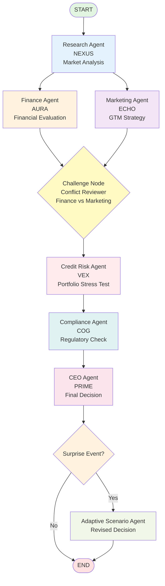

# Agentic Swarm - AI Boardroom
### Team: Agent Zero
**Members:** Anuj Agarwal · Palak Malhotra · Pranjal Rai

---

## Challenge Selected
Build a multi-agent AI system that simulates a business boardroom. Given any business problem, a swarm of specialized AI agents analyses, debates, challenges assumptions, and reaches a structured CEO decision - then adapts when surprise events are injected.

## Solution Summary
Agentic Swarm is a LangGraph-powered multi-agent decision engine with a web interface. Six specialized agents run in a structured boardroom protocol - Analyse, Share, Challenge, Compare, Decide - and produce a CEO directive with evidence, rejected alternatives, risks, implementation steps, and measurable KPIs. A Surprise Round forces the swarm to re-evaluate the decision against unexpected market events in real time.

---

## Agent List

| Agent | Role | Input | Output |
|-------|------|-------|--------|
| Business Research Agent (NEXUS) | Market analysis - opportunity, segment demand, competitors, risks | Business problem statement | 4-point research brief forwarded to Finance, Marketing, Compliance |
| Finance and Treasury Agent (AURA) | Cost of funds, liquidity buffers, revenue, break-even, financial margins | Business problem + Research output | RECOMMEND or DO NOT RECOMMEND with key financial rationale |
| Marketing and Sales Agent (ECHO) | Target segment, positioning, acquisition channels, CAC, marketing risk | Business problem + Research output | GO or NO-GO with channel acquisition strategy |
| Compliance and Customer Protection Agent (COG) | Fair customer treatment, compliance guidelines, operational capacity, execution risk | Business problem + all dept outputs | FEASIBLE or NOT FEASIBLE with operational/compliance risk |
| Credit Risk Agent (VEX) | Credit risk, default modeling, stress-tests most dangerous assumption | All department outputs | ASSUMPTION CHALLENGED + WHY IT COULD BE WRONG + WHAT CEO MUST VERIFY |
| CEO Agent (PRIME) | Synthesizes all agent inputs into final executive directive | All department outputs | DECISION + EVIDENCE USED + REJECTED ALTERNATIVE + KEY RISKS + IMPLEMENTATION + 3 KPIs |
| Adaptive Scenario Agent | Re-evaluates corporate decision against a new market or regulatory shock | CEO decision + surprise event | WHAT CHANGED + WHAT STAYS THE SAME + REVISED DECISION + UPDATED KPIs |


---

## Installation

**Requirements:** Python 3.10+, pip, Google Gemini API key

**Step 1 - Clone the repo:**
```bash
git clone https://github.com/anuj-71/AgentZero.git
cd AgentZero
```

**Step 2 - Install dependencies:**
```bash
pip install -r requirements.txt
```

**Step 3 - Create .env file in project root:**
```env
GOOGLE_API_KEY=your_gemini_api_key_here
GEMINI_MODEL=gemini-3.1-flash-lite
```

**Step 4 - Run the server:**
```bash
python app.py
```

**Step 5 - Open in browser:**
```
http://127.0.0.1:5000
```

**Step 6 - Test backend only (optional):**
```bash
python agents/swarm.py "Your business problem here"
```

**Step 7 - Test with surprise round:**
```bash
python agents/swarm.py "Your business problem" "Your surprise event"
```

---

## Models, Frameworks and External Services

| Component | Details |
|-----------|---------|
| LLM | Google Gemini 3.1 Flash Lite via Gemini API |
| Agent Framework | LangGraph 1.x - StateGraph with fan-out/fan-in topology |
| LLM Integration | LangChain Google GenAI (langchain-google-genai) |
| Backend | Flask + Flask-CORS |
| Frontend | Vanilla HTML/CSS/JS - No framework |
| Voice | ElevenLabs API + Web Speech API fallback |
| Environment | python-dotenv |
| External APIs | Google Generative Language API, ElevenLabs API |

---

## Agent Graph Topology

### Visual Architecture



### Execution Flow

```
START
  └── Research Agent (NEXUS)
        ├── Finance & Treasury Agent (AURA) ────────┐
        └── Marketing & Sales Agent (ECHO) ─────────┴── Conflict Reviewer (Challenge Node)
                                                              └── Credit Risk Agent (VEX)
                                                                    └── Compliance Agent (COG)
                                                                          └── CEO Agent (PRIME)
                                                                                └── [Conditional] Adaptive Surprise Agent
                                                                                      └── END
```

### State Management

The swarm uses LangGraph's `StateGraph` with typed state dictionary:

| State Field | Type | Purpose |
|------------|------|---------|
| `business_problem` | str | Input business case |
| `research_output` | str | NEXUS market analysis |
| `finance_output` | str | AURA financial recommendation |
| `marketing_output` | str | ECHO GTM strategy |
| `credit_risk_output` | str | VEX portfolio risk assessment |
| `compliance_output` | str | COG regulatory check |
| `challenge_log` | str | Conflict identification & resolution |
| `ceo_decision` | str | PRIME final directive |
| `kpis` | list[str] | Measurable business KPIs |
| `surprise_input` | str | Unexpected market event |
| `revised_decision` | str | Adaptive CEO response |
| `current_stage` | str | Current execution phase |
| `trace` | list[str] | Audit log of all agent activities |

### Agent Communication Pattern

1. **Fan-out:** Research agent outputs are consumed by Finance and Marketing in parallel
2. **Synchronization:** Challenge node waits for both Finance and Marketing before proceeding
3. **Sequential:** Credit Risk → Compliance → CEO form a linear validation chain
4. **Conditional:** Surprise agent only activates if `surprise_input` is provided
5. **State-based:** All agents read from and write to shared state dictionary

Structured boardroom execution: Each specialist agent runs as an isolated LangGraph node with its own domain prompt and context injection.

---

## Known Limitations and Failure Handling

1. **Rate limits:** Multi-tier Gemini API key pool fallback with automatic failover across primary and backup keys.
2. **Agent failure fallback:** Every agent wraps its LLM call in try/except. If one agent fails, it returns a fallback message and the graph continues - the CEO agent will note the missing input.
3. **Surprise round:** Adaptive CEO node re-evaluates and pivots corporate strategy upon injected market shocks.
4. **Context window:** Optimized structured prompts with numerical constraint verification prevent truncation.
5. **TTS availability:** ElevenLabs voice synthesis with browser-native Web Speech API fallback.

---

## Declaration of Pre-existing and Reused Components

| Component | Source | Usage |
|-----------|--------|-------|
| LangGraph | Open-source, LangChain Inc. | Agent workflow orchestration |
| LangChain Google GenAI | Open-source, LangChain Inc. | Gemini API integration |
| Flask | Open-source, Pallets Projects | Web server |
| Gemini API | Google | LLM inference for all agents |
| ElevenLabs API | ElevenLabs | Voice synthesis for boardroom agents |
| Web Speech API | Browser-native W3C standard | TTS voice narration fallback |
| jsPDF | Open-source, Parallax | Client-side dynamic PDF report generation |

All agent logic, system prompts, graph topology, state design, frontend UI, and boardroom protocol implementation are original work created by Team Agent Zero for this hackathon.

---

## Project Structure

```text
AgentZero/
├── agents/
│   └── swarm.py              # LangGraph swarm - all 8 agent nodes
├── ai_boardroom/
│   ├── templates/
│   │   └── index.html        # Interactive AI Boardroom UI & PDF Report Generator
│   ├── core/
│   │   └── config.py         # Swarm configurations & presets
│   └── open_app.py           # Quick-launch browser opener
├── frontend/
│   └── index.html            # Terminal UI alternative
├── data/
│   └── testcases_report.json # Theme A comprehensive 5-testcase evaluation data
├── app.py                    # Flask server + API routes (/api/run, /api/tts, /api/testcases-report)
├── run_all_tc.py             # Test harness to execute all 5 Theme A test cases
├── .env.example              # Environment variables template (no keys committed)
├── .gitignore                # Git ignore rules (.env protected)
├── README.md                 # Project documentation
└── requirements.txt          # Python dependencies
```

---

---

## How to Run the Application

### Method 1: Web Interface (Recommended for Judges)

1. **Start the server:**
   ```bash
   python app.py
   ```

2. **Open in browser:**
   ```
   http://127.0.0.1:5000
   ```

3. **Enter business problem:**
   - Paste any test case problem statement (see Test Cases section below)
   - Click "CONVENE BOARDROOM" or "DEPLOY STRATEGY"
   - Watch agents execute in real-time

4. **View results:**
   - Research, Finance, Marketing, Credit Risk, Compliance outputs
   - CEO decision with evidence, risks, and KPIs
   - Full execution trace

5. **Test surprise round:**
   - Enter a surprise event (e.g., "Cost of funds rises to 13%")
   - Click submit to see adaptive decision

---

### Method 2: Command Line (For Quick Testing)

**Basic run (no surprise):**
```bash
python agents/swarm.py "Your business problem here"
```

**With surprise event:**
```bash
python agents/swarm.py "Your business problem" "Your surprise event"
```

**Example:**
```bash
python agents/swarm.py "FinNova Capital has INR 30 crore available for a small-business lending pilot..." ""
```

---

### Method 3: Run All Theme A Test Cases

**Generate complete test case report:**
```bash
python run_all_tc.py
```

This will:
- Execute all 5 Theme A test cases (TC1-TC5)
- Generate full agent outputs for each test case
- Save results to `data/testcases_report.json`
- Takes approximately 5-10 minutes depending on API response time

**View the report:**
```bash
# Start server
python app.py

# Open browser and navigate to:
http://127.0.0.1:5000/api/testcases-report
```

---

## Test Cases (Theme A - FinSwarm)

Copy-paste these into the web interface to test the swarm:

### TC1: BASELINE - LAUNCH THE SMALL-BUSINESS LOAN

**Problem Statement:**
```
FinNova Capital has INR 30 crore available for a one-year small-business lending pilot and INR 60 lakh for customer acquisition. It can initially approve no more than 700 loans. Common costs: Cost of funds 10% per year, Servicing and collections cost 1.5% of principal per year, Product setup cost INR 18 lakh (deducted from acquisition budget). Segment data: Retail shops avg loan INR 4L, 5% default, 1500 demand, INR 2,000 CAC; Service SMEs avg loan INR 6L, 3.5% default, 900 demand, INR 3,500 CAC; Small manufacturers avg loan INR 9L, 4.5% default, 450 demand, INR 5,500 CAC. Constraints: Expected portfolio default <= 5%, Max interest 19%, No segment > 70% of capital, At least INR 3 crore liquid reserve, Max 700 approved loans. Question: Which segment mix, pricing, approval policy and launch plan creates the strongest risk-adjusted business outcome?
```

**Surprise:** (leave empty for TC1)

---

### TC2: SURPRISE - CREDIT-RISK SPIKE

**Problem Statement:**
```
FinNova Capital is running a one-year INR 27 crore pilot with 600 planned loans (Retail 45%, Service SMEs 35%, Small manufacturers 20%, 17% interest, 10% cost of funds, 1.5% servicing). New condition: Retail expected default rises to 8%, Service SME expected default rises to 5%, Small manufacturer expected default rises to 7%. Risk committee requires expected portfolio default to remain at or below 5.5%. Tighter approval rules reduce eligible demand by 25%. Pausing creates INR 12 lakh sunk launch costs. All changes within 30 days. Question: Should FinNova continue, redesign or pause the pilot? Specify revised portfolio, pricing, controls and implementation plan.
```

**Surprise:**
```
Retail default rose to 8%, Service SME to 5%, Manufacturer to 7%. Risk committee mandates <= 5.5% portfolio default.
```

---

### TC3: SURPRISE - MARKETING BUDGET CUT

**Problem Statement:**
```
FinNova Capital will launch in eight weeks. Customer acquisition budget reduced from INR 60 lakh to INR 36 lakh. Setup requires INR 18 lakh, leaving INR 18 lakh for marketing. Target: >= 400 qualified applications, >= 160 funded loans. Channels: Partner accountants (INR 3,000 CPA, 45% conversion), Digital ads (INR 1,800 CPA, 25% conversion), Trade associations (INR 4,000 CPA, 60% conversion), Existing customer referrals (INR 1,200 CPA, 40% conversion, max 120 apps). Constraints: Marketing spend <= INR 18 lakh, max 65% in one channel, launch delay <= 2 weeks, transparent pricing and repayment obligations. Question: How should the reduced budget be allocated? Should target segment, launch timing or funded-loan target be revised?
```

**Surprise:**
```
Marketing budget cut to INR 18 lakh net. Must achieve >= 400 qualified applications and >= 160 funded loans across 4 channels.
```

---

### TC4: SURPRISE - STRICTER VERIFICATION REQUIREMENTS

**Problem Statement:**
```
FinNova Capital processes 500 applications/week, approves 35% (175/week), 12-minute onboarding, uses manual verification for 10% (17.5/week), employs 8 reviewers (each does 4 reviews/day, 5 days/week = 160 reviews/week capacity). New requirement: Enhanced ownership and bank-statement verification before disbursement. Automated checks clear 60%. Remaining 40% require manual review (70/week). Options: Hire 4 temporary reviewers at INR 45,000/month each, reduce intake, appointment-based onboarding, delay launch up to 4 weeks, integrate automated verification service (costs INR 8 lakh, 2 weeks). Constraints: 3-month budget INR 15 lakh, median approval < 48 hours, complaint rate < 2%, zero disbursement before verification. Question: What operating model should FinNova implement to satisfy the new verification requirement without unacceptable delays or customer harm?
```

**Surprise:**
```
Mandatory enhanced verification: 40% manual review required before disbursement. 3-month budget INR 15 lakh, approval < 48 hours.
```

---

### TC5: LIVE TEST - FUNDING-COST AND FRAUD SHOCK

**Problem Statement:**
```
FinNova Capital approved plan to deploy INR 24 crore across 500 loans (17.5% interest, 4.5% default, 10% cost of funds, 1.5% servicing, 50% retail, 2% suspected fraud). Live shock: Cost of funds rises to 13%, suspected retail fraud rises to 7%. Controls: Fraud-screening service (costs INR 1,200/retail app, cuts fraud 60%), reduce retail allocation, increase pricing up to 19%, introduce manual review, reduce total capital deployment, delay retail launch. Fixed limits: >= INR 3 crore liquid reserve, expected portfolio default after controls <= 5.5%, max customer interest 19%. Question: Revise portfolio, controls, pricing and launch decision. Identify which original assumptions are no longer valid.
```

**Surprise:**
```
Cost of funds surged to 13%, Retail fraud jumped to 7%. Maintain >= INR 3 crore liquid, default <= 5.5%, interest <= 19%.
```

---

## Important Notes

### No Hardcoded Results

- ✅ All decisions are generated dynamically by LLM agents
- ✅ Each agent analyzes the problem independently
- ✅ Results may vary slightly between runs due to LLM inference
- ✅ The swarm adapts to any business problem, not just test cases

### Testing Flexibility

You can test with:
- Any of the 5 official test cases above
- Modified versions of test cases
- Completely new business problems
- Custom surprise events

The agent swarm will analyze any valid business problem and produce a structured decision following the boardroom protocol.

---

## Quick Demo Script (for Judges)

1. Open http://127.0.0.1:5000
2. Copy-paste TC1 problem statement from above
3. Click CONVENE BOARDROOM / DEPLOY STRATEGY
4. Watch agents fire in sequence across the Swarm Analytics view
5. Navigate to Decide to see the full CEO directive with:
   - Strategy comparison (A vs B)
   - Final decision with evidence
   - Rejected alternatives
   - Key risks and trade-offs
   - Implementation steps
   - 3 measurable KPIs
6. For surprise round: Copy-paste TC2 problem + surprise event
7. Watch the swarm adapt and revise the decision in real-time

---

*Built at Agentic Swarm Hackathon - Team Agent Zero*
