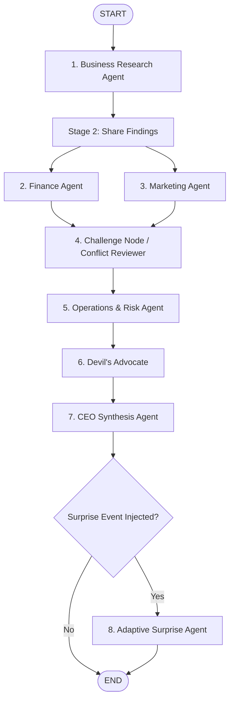

# Agent Zero // The AI Boardroom Decision Swarm

**Official Submission for the Agentic Swarm Challenge**

---

## 1. Team Information

* **Team Name:** Agent Zero
* **Team Members:**
  * Anuj Agarwal
  * Palak Malhotra
  * Pranjal Rai

---

## 2. Challenge Selection & Solution Summary

### Selected Challenge
**The Autonomous Enterprise Boardroom: Cross-Departmental Strategy & Scenario Adaptation**  
*(Demonstrated on Multi-Market Business Expansions, SaaS Enterprise Pivots, and Quick-Commerce Scale-Ups)*

### One-Paragraph Solution Summary
Agent Zero is a multi-agent decision intelligence system powered by LangGraph, Google Gemini, and Flask that mirrors an executive boardroom to solve complex, unstructured business problems. The swarm orchestrates six specialized department agents (Research, Finance, Marketing, Operations, Challenge Reviewer, and Devil's Advocate) through a structured 5-stage protocol: independent analysis, explicit cross-department information sharing, dialectic conflict challenge, strategy comparison, and executive synthesis by a CEO agent with actionable KPIs and assigned department ownership. When unforeseen market disruptions occur, an integrated adaptive surprise engine recalculates constraints, identifies changed assumptions, and issues a revised strategic directive with updated KPIs without requiring a system rebuild.

---

## 3. System Architecture & Workflow

The decision workflow is implemented as a deterministic Directed Acyclic Graph (DAG) using LangGraph StateGraph, guaranteeing termination without infinite debate loops while supporting parallel fan-out and serialized critical reviews.



---

## 4. Agent Roster (Roles, Inputs & Outputs)

Every agent operates with dedicated system instructions, separate LLM instances, explicit inputs, and visible outputs in the execution trace.

| Agent | Codename & Role | Core Responsibility | Input Received | Visible Output |
| :--- | :--- | :--- | :--- | :--- |
| **Business Research** | `Nexus` (Lead Researcher) | Analyzes market size, CAGR, customer demographics, competitor benchmarks, and strategic entry barriers. | Raw Business Problem Statement | 4 structured findings forwarded to Finance, Marketing, and Operations. |
| **Finance** | `Aura` (Chief Financial Officer) | Evaluates unit economics, capex/opex requirements, cash runway, break-even timelines, and financial risks. | Problem Statement + Research Output | Clear RECOMMEND / DO NOT RECOMMEND verdict with break-even model & key financial rationale. |
| **Marketing & Sales** | `Echo` (Chief Marketing Officer) | Formulates positioning, target personas, top 2 acquisition channels, CAC projections, and go-to-market strategy. | Problem Statement + Research Output | Clear GO / NO-GO recommendation with positioning and acquisition strategy. |
| **Challenge Reviewer** | `Conflict Node` (Dialectic Engine) | Evaluates friction and strategic conflicts between Finance and Marketing projections, formulating executive reconciliation. | Finance Output + Marketing Output | Explicit identification of department disagreement and proposed resolution. |
| **Operations & Risk** | `Cog` (Chief Operating Officer) | Assesses supply chain logistics, operational feasibility, execution bottlenecks, and regulatory compliance. | Problem + Research + Finance + Marketing Outputs | FEASIBLE / NOT FEASIBLE verdict with the single biggest operational bottleneck. |
| **Devil's Advocate** | `Vex` (Critical Stress-Tester) | Challenges the single most dangerous assumption made across all departments before executive commitment. | All Department Dossiers (Research, Finance, Marketing, Operations) | ASSUMPTION CHALLENGED, WHY IT COULD BE WRONG, and WHAT CEO MUST VERIFY. |
| **CEO Agent** | `Prime` (Chief Executive Officer) | Synthesizes all department inputs, compares alternative strategies, rejects sub-optimal paths, and issues the mandate. | All 6 Department Outputs + Challenge & Devil's Advocate Logs | Strategy Comparison, Final Decision, Evidence Used (citing agents by name), Rejected Alternative, Risks, 3 Implementation Steps with Owners, and 3 Measurable KPIs. |
| **Surprise Agent** | `Prime-Adaptive` (Scenario Planner) | Re-evaluates corporate strategy under sudden market shocks (competitor price wars, regulatory shifts, supply failures). | Original CEO Decision + Injected Surprise Event | What Changed, What Stays the Same, Revised Strategy Directive, and Updated KPIs. |

---

## 5. 5-Stage Boardroom Protocol Implementation

The system strictly demonstrates the 5-stage boardroom protocol required by Section 3 of the Official Rulebook:

1. **Stage 1 (Analyse):** Research, Finance, and Marketing agents independently examine the business brief from their respective domain lenses.
2. **Stage 2 (Share):** Explicit data forwarding logged in the execution trace (`[SHARE] Research brief ingested by Finance`, `[SHARE] Department dossiers routed to Operations`).
3. **Stage 3 (Challenge):** The Challenge Node actively pits Finance vs Marketing assumptions, while Devil's Advocate stress-tests the overall operational thesis.
4. **Stage 4 (Compare):** The CEO agent explicitly compares two viable strategies (e.g., Aggressive Direct Entry vs Phased Capital-Light Expansion) before deciding.
5. **Stage 5 (Decide):** The CEO selects one coordinated strategy, citing specific agents by name, documenting rejected alternatives, assigning department owners per implementation step, and committing to 3 measurable KPIs.

---

## 6. Installation & Execution Instructions

### Prerequisites
* Python 3.10, 3.11, or 3.12
* Google Gemini API Key ([Google AI Studio](https://aistudio.google.com/))

### Step 1: Clone the Repository
```bash
git clone https://github.com/anuj-71/AgentZero.git
cd AgentZero
```

### Step 2: Set Up Virtual Environment
```bash
# Create virtual environment
python -m venv .venv

# Activate on Windows
.venv\Scripts\activate

# Activate on macOS / Linux
source .venv/bin/activate
```

### Step 3: Install Dependencies
```bash
pip install -r requirements.txt
```

### Step 4: Configure Environment Variables
Copy `.env.example` to `.env` and insert your API key:
```bash
cp .env.example .env
```

Edit `.env`:
```env
GOOGLE_API_KEY=your_actual_gemini_api_key_here
GEMINI_MODEL=gemini-3.1-flash-lite
```

### Step 5: Launch the Application
```bash
python app.py
```

### Step 6: Access the Web Interfaces
* **Interactive AI Boardroom UI:** Open `http://127.0.0.1:5000` in your web browser.
* **Dark Terminal SPA UI:** Open `http://127.0.0.1:5000/terminal` in your web browser.
* **CLI Execution (Headless):**
  ```bash
  python agents/swarm.py "A food delivery startup wants to expand to tier-2 Indian cities" "Competitor launched free delivery"
  ```

---

## 7. Models, Frameworks, Datasets & Services Used

* **Language Model:** Google Gemini 3.1 Flash Lite (`gemini-3.1-flash-lite`) via `langchain-google-genai` (low latency, high token efficiency, avoids rate-limit exhaustion during parallel multi-agent fan-out).
* **Multi-Agent Orchestration:** LangGraph (`StateGraph`, `START`, `END`, conditional edges) with typed state reduction (`Annotated`, `TypedDict`).
* **Backend Framework:** Python Flask with Flask-CORS for REST API endpoint serving (`POST /api/run`).
* **Frontend Technologies:** HTML5, Vanilla CSS3 (Custom Dark Theme & Boardroom Canvas), Vanilla JavaScript (ES6+), Web Speech API for real-time speech synthesis (TTS).
* **External APIs & Datasets:** Google Generative Language API. No private or copyright-protected training datasets used.

---

## 8. Known Limitations & Failure-Handling Behavior

### Failure-Handling Architecture (Rulebook Item 31 & 45)
* **Per-Agent Try/Except Fallback:** Every agent invocation is wrapped in a dedicated error-handling wrapper in `_call_llm()`. If any individual agent fails (e.g. timeout, rate limit, or invalid response), the exception is caught, and a safe diagnostic placeholder is returned:
  ```text
  [AGENT ERROR] Finance Agent failed: <error details>. Proceeding with available data.
  ```
* **Non-Blocking Execution:** The graph workflow continues to the next node even if a department agent encounters an error, ensuring the CEO Agent always receives available evidence and produces a final decision.
* **Debate Loop Control (Rulebook Item 30):** The LangGraph DAG topology is strictly deterministic with conditional branching terminating at `END`, preventing uncontrolled conversation loops.

### Known Limitations
* **API Rate Limits:** Free-tier Google AI Studio keys are subject to Requests-Per-Minute (RPM) limits. `gemini-3.1-flash-lite` was selected specifically to minimize quota consumption.
* **TTS Platform Variance:** Web Speech API voice accents vary depending on the host OS and browser engine.

---

## 9. Declaration of Pre-Existing & Reused Components

In compliance with Academic and Competitive Integrity rules (Rulebook Section 10):

* **Open-Source Libraries:** `langgraph`, `langchain-core`, `langchain-google-genai`, `flask`, `flask-cors`, `python-dotenv`.
* **Fonts & Icons:** Google Fonts (Inter, JetBrains Mono), inline standard SVG icons.
* **Original Work Created During Event:**
  * Swarm architecture, state graph definition, and edge routing in `agents/swarm.py`.
  * Specialized system prompts and explicit information exchange protocols.
  * Flask REST API integration and payload serialization in `app.py`.
  * AI Boardroom audio-visual canvas and state-driven UI in `ai_boardroom/templates/index.html`.
  * Dark terminal single-page application in `frontend/index.html`.

---

## 10. Repository Structure

```text
AgentZero/
├── agents/
│   └── swarm.py                 # 6-agent LangGraph workflow, nodes, and state definitions
├── ai_boardroom/
│   ├── templates/
│   │   └── index.html           # Interactive AI Boardroom UI with Canvas & TTS
│   ├── core/
│   │   └── config.py            # Boardroom configuration and voice profiles
│   ├── open_app.py              # Standalone local launcher
│   └── requirements.txt         # Module dependencies
├── frontend/
│   └── index.html               # Dark Terminal single-page application
├── app.py                       # Flask REST server exposing /api/run and static routes
├── requirements.txt             # Primary Python dependencies
├── .env.example                 # Environment configuration template
├── .gitignore                   # Git ignore protecting secrets (.env)
└── README.md                    # Official project documentation and audit guide
```
